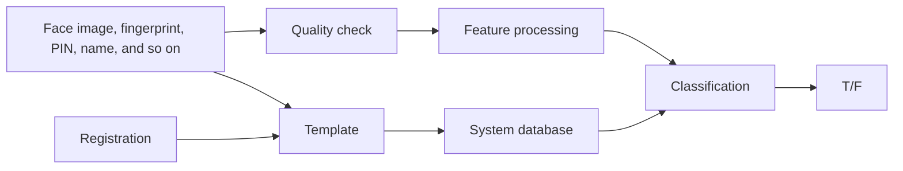
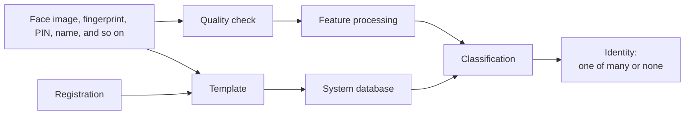

# Week 2 Workings of a Biometrics System

## Directory
- [Home](/README.md#table-of-contents)
- [Week 1 Introduction to Biometrics](/week1/README.md#week-1-introduction-to-biometrics)
- **&rarr;[Week 2 Workings of a Biometrics System](/week2/README.md#week-2-workings-of-a-biometrics-system)**
- [Week 3 Physiological Biometrics: Fingerprint Biometrics](/week3/README.md#week-3-physiological-biometrics-fingerprint-biometrics)
- [Week 4 Physiological Biometrics: Facial Recognition Systems](/week4/README.md#week-4-physiological-biometrics-facial-recognition-systems)
- [Week 5 Other Biometrics: Iris, Hand Geometry, Palm Print, DNA](/week5/README.md#week-5-other-biometrics-iris-hand-geometry-palm-print-dna)
- [Week 6 Heart Beat and Some Machine Learning Algorithms](/week6/README.md#week-6-heart-beat-and-some-machine-learning-algorithms)
- [Week 7 Performance Evaluation](/week7/README.md#week-7-performance-evaluation)
- [Week 8 Behavioral Biometrics: Keystrokes, Gait, Handwriting, Voice](/week8/README,md#week-8-behavioral-biometrics-keystrokes-gait-handwriting-voice)
- [Week 9 Continuous Authentication](/week9/README.md#week-9-continuous-authentication)
- [Week 10 Biometric Systems Security](/week10/README.md#week-10-biometric-systems-security)

## Stages of a Biometric System

- Registration (enrollment), verification, identification

### Verification
- face, iage, fingerprint, PIN, name and so on
- quality check
- feature processing
- classification 
  - system database with template

### Verification Process

| Verification Process                           | Description |
| --------------------------------------------- | ----------- |
| Claimed identity \(I\). Feature vector \(X_o\). Class \(w_1\) or \(w_2\); \(t\) is a predefined threshold.                        | If the stored biometric template of the user \(I\) is \(X_i\) and the acquired template is \(X_o\), then the null and alternate hypothesis are: |
|                         | \(H_0\): Input \(X_o\) does not come from the same person as the template \(X_i\). |
| | \(H_1\): Input \(X_o\) comes from the same person as the template \(X_i\). |
| Represents a similarity function.             | The decisions are: \(D_0\): Person is not who she claims to be. \(D_1\): The person is who she claims to be. |

### Stages of an Identification System

### Identification 

| Identification Process                                   | Description |
| -------------------------------------------------------- | ----------- |
| Claimed identity \(I\). Feature vector \(X_o\). Class \(w_1\) or \(w_2\); \(t\) is a predefined threshold. | If the stored biometric template of the user \(I\) is \(X_i\), and the acquired template is \(X_o\), then the null and alternate hypothesis are: |
|                                    | \(H_0\): Input \(X_o\) does not come from the same person as the template \(X_i\). |
|  | \(H_1\): Input \(X_o\) comes from the same person as the template \(X_i\). |
| Represents a similarity function.                        | The decisions are: \(D_0\): Person is not who she claims to be. \(D_1\): The person is who she claims to be. |

## Sensor Overload

### primary biometric sensors
- Electrical-optical (EO) sensors
  - visual spectrum
  - infrared (IR)
- LiDAR (light detection and ranging)
- touch
- electrocardiogram
- others
  - ultraviolet (UV)
  - RaDAR (radio detection and ranging)
  

## Biometric Sensors: IR Spectrum
- Infrared (IR) cameras
  - passive sensors
  - rely on infrared waves emitted frm object
- hardware
  - lens
  - charged-couple device (CCD)
- values
  - generally monochromatic

### Infrared Basics
- humans cannot sense infrared with their eyes
  - some animals (pit vipers) can, eg in the US, rattlesnakes, copperheads, and cottonmouths
- broken in to near-, short-,  mid-, long-, and far-field infrared

### Illumination Effects
- CCDs detect light from outside sources
- Intensity is based on  energy emitted from objects (Hotter is Brighter)

### Camera Hardware
- Lens
  - Infrared cannot pass through glass
  - Other materials are needed for lenses
- CCD
  - Digital sensor for detecting infrared waves
    - Generally, for only small part of spectrum
  - Cooling required for longer wave sensors

### IR Pros and Cons
- Pros
  - Easy to model outputs
  - computing hardware optimized for medium type like visual spectrum
  - more robust to environmental factors (dust, water vapor)
  - does not require illumination
- Cons
  - affected pose differences
  - Expensive

## Biometric Sensors: Visual Spectrum

### Overview
- visual spectrum sensors (cameras)
  - passive sensors
  - rely on natural or artificial illumination
- hardware
  - lense
  - charged-coupled device (CCD)
- Values
  - monochromatic (greyscale)
  - tricolor [usually red-green-blue (RGB)]

### Visual Spectrum Basics
- Most humans and digital camera have receptors for red, green, and blue RGB light
  - Humans have rods
  - Digital cameras have charged-coupled device (CCD) for each spectrum

### Illumination Effects
- CCDs detect light from outside light sources
- Light color is based on source color and reflected/refracted materials
### Camera Hardware
- Lense
  - focuses or defuses light beams
  - Can be coupled with filters to only let certain light in
- CCD
  - Digital sensor for detecting light
  - Usually on chips with red, green, and blue CCDs group together in a square pattern to emulate a pixel.

### Color Schemes
- Monochromatic (gray scale)
  - easier to program too
  - uses less space
- Tricolor (RGB)
  - more nuanced images (can mean better performance)
  - uses more data

### Visual Spectrum Pros and Cons
- Pros
  - sensors are cheap and ubiquitous
  - easy to model outputs
  - computing hardware optimized for medium type
- Cons
  - affected by illumination and pose difference
  - easily affected by environment

## Biometric Sensors: LiDAR

### Overview
- Lidar sensors
  - active sensors
  - used coupled lasers and sensors
- hardware
  - lens
  - charged-coupled device (CCD)
- Values
  - Generally monochromatic

### Lidar Basics
- Lidar: used to mean Light Detection And Ranging
- have active sensors that both transmit and detect light
- usually use infrared light, but can use visual spectrum and ultraviolet (UV)
- measure range between sensor and objects
  - tracks time from when light was transmitted to when received

### Transmitting and Receiving
- laser sends out pulse angle and time send recorded
- when laser is received time is recorded again and range calculated based on speed of light
- angle adjusted

### Lidar Pros and Cons
- Pros
  - can make 3D models of spaces
- Cons
  - extremely expensive

## Biometric Sensors: Touchscreens

### Overview
- touch sensors
  - passive sensors
  - use many technologies
- Hardware
  - contract sensors
- values
  - return values

### Touchscreen Types
- optical scanner: takes a picture of your finger
- capacitive scanner: use electrical scanners embedded in surface to detect touching
- thermal scanner: uses difference in temperature between ridges and values

### Touchscreen Pros and Cons
- pros
  - ubiquitous and cheap
- cons
  - common ones tend to be inaccurate

## Live Session

Research Sources
- Syracuse Library
- IEEE, ACM
- (scholar.google.com)[scholar.google.com]

### ML Metrics

### Machine Learning Analysis
- for two class prediction systems (ie verification)
  - true positive: system correctly returned True when result should be true
  - true negative: system correctly return False when result should be false
  - false positive: system returned true when result should be false
  - false negative: system return false when result should be true
- conditional positive (P) the number of true positives in data
- conditional negative (N) the number of real negatives in the data

Machine learning is bad at extrapolation

### Machine Learning Metrics
- Sensitivity/Recall/True Positive Rate:
`TPR = TP / P = TP / (TP + FN) = 1 – FNR`
- Specificity/Selectivity/True Negative Rate :
`TNR: TN / N = TN / (TN + FP) = 1 – FPR`
- Precision: 
`PPV = TP / (TP + FP)`
- False Positive Rate (False Alarm Rate): 
`FPR = FP / N = 1 - PPV`
- False Negative Rate (False Rejection Rate):
`FNR = FN / P = 1 - TNR`
- Accuracy = `(TP + TN) / (P + N)` (top line number)
- `F1 = 2 * TP / (2TP + FP + FN)`
  - with LLMs you get a lot of false negatives and negatives.
  - want a value closer to 1
  - below 1, you have too many FP and FN

  ### Confusion Matrix
  - accuracy 
  - mean accuracy