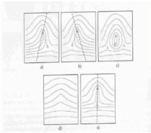
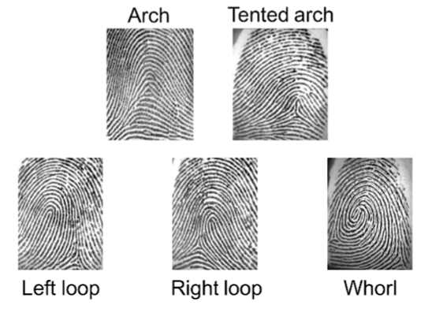
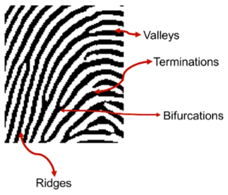
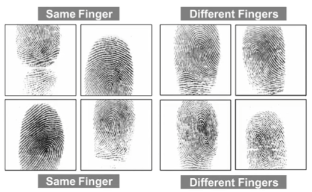
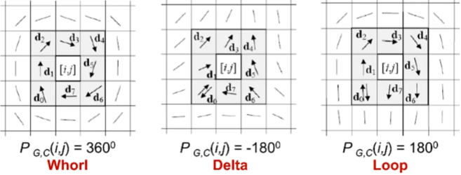

# Week 3 Physiological Biometrics: Fingerprint Biometrics

## Directory
- [Home](/README.md#table-of-contents)
- [Week 1 Introduction to Biometrics](/week1/README.md#week-1-introduction-to-biometrics)
- [Week 2 Workings of a Biometrics System](/week2/README.md#week-2-workings-of-a-biometrics-system)
- **&rarr;[Week 3 Physiological Biometrics: Fingerprint Biometrics](/week3/README.md#week-3-physiological-biometrics-fingerprint-biometrics)**
- [Week 4 Physiological Biometrics: Facial Recognition Systems](/week4/README.md#week-4-physiological-biometrics-facial-recognition-systems)
- [Week 5 Other Biometrics: Iris, Hand Geometry, Palm Print, DNA](/week5/README.md#week-5-other-biometrics-iris-hand-geometry-palm-print-dna)
- [Week 6 Heart Beat and Some Machine Learning Algorithms](/week6/README.md#week-6-heart-beat-and-some-machine-learning-algorithms)
- [Week 7 Performance Evaluation](/week7/README.md#week-7-performance-evaluation)
- [Week 8 Behavioral Biometrics: Keystrokes, Gait, Handwriting, Voice](/week8/README,md#week-8-behavioral-biometrics-keystrokes-gait-handwriting-voice)
- [Week 9 Continuous Authentication](/week9/README.md#week-9-continuous-authentication)
- [Week 10 Biometric Systems Security](/week10/README.md#week-10-biometric-systems-security)

## Physiological Biometrics: Fingerprint Biometrics

### Outline of Topics: Fingerprints

- what are fingerprints
- characteristics of fingerprint images
  - examples of fingerprint images
- types of scanners
- features in fingerprints
- matching

### History

#### Ancient Stone Fingerprint
- neolithic carvings
- standing stone (2000 BC)
- chinese clay seal (300 BC)
- palestinian lamp (400 AD)

#### Modern History

- 1684 nehemiah grew
- 1788 mayer
- 1823 finger print classification
- 19th century - minutiae features
- current - huge advancements - fingerprinting in real time

### Fingerprint Recognition

- What are fingerprints?
  - fingerprints are reproduction of fingerprint epidermis
  - typically produced when a finger is presses against a smooth surface
- Most evident characteristics are a pattern of interleaved ridges and valleys
  - ridges or ridge lines are dark, whereas valleys are bright
  - ridges and valleys run in parallel; they may bifurcate or they may terminate

### Characteristics of Digital Fingerprint Images
- resolution
  - five hundred (500 dots) or pixels per inch
  - FBI (250-300 dpi needed to allow extraction of minutiae in fingerprint patterns)
- area
  - size of the rectangular area sensed by the scanner; 1x1 inch required by FBI specifications
- number of pixels

- dynamic range or depth
  - number of bits required to encode: FBI 8 bits resulting in 256 levels of gray
- Geometric accuracy
  - maximum geometric distortion by the acquisition device; expressed as percentage with respect to x and y
- image quality

### Fingerprint Acquisition

#### Forensic Fingerprint
- patent prints
  - easy to locate since thy are visible to the naked eye
  - occur when someone has a substance on their fingers such as grease, paint, blood, or ink that leaves a visible print on a surface
- plastic prints
  - easy to locate but are less common than patent prints
  - occur when someone touches an object such as bax, butter, or soap and leaves a 3D impression of the finger on the object.
- latent prints
  - the most common type of print
  - take the most effort to locate since the are invisible
  - latent prints occur when someone touches any porous or nonporous surface
  - the natural oils and residue on fingers leave a deposit on surfaces which mirror the ridges and furrows that are present on the individual's finger

#### Fingerprint Image Quality
- skin condition can affect fingerprint image quality
  - wet or dry
  - cuts and bruises
- sensor noise (smudge on the surface etc)
- incorrect finger pressure
- inherent low-quality fingers (elderly, manual labor)

#### Skin Distortion
- one of the main factor that contribute to make substantially different the impressions of given finger is skin distortion

#### Quality Parameters
- Original
  - acquisition area
  - output resolution
  - geometric accuracy
  - spatial frequency response
  - signal to noise ratio
  - fingerprint gray range

### Singularities

- at a global level, fingerprints patterns exhibit regions called singularities
  - where ridge lines show distinctive shapes - high curvature, frequent termination, etc
  - singularities or singular regions may be classified into three topologies:
    - loop &cap;, delta &#8710;, whorl O
- fingerprint matching algorithms algin fingerprint images according to landmark or a center point called core, which corresponds center fo the northernmost loop type singularity

### Illustration

- a. left loop
- b. right loop
- c. whorl
- d. arch
- e. tented arch
- features in fingerprints
  - ridges and valleys
  - loops, whorl, arches
  - local ridge orientation and frequency

- &#8710; delta type singular point
- &#9723; loop type singular point

### Fingerprint Classes

### Minutiae Points

- the minutiae, or Galton's characteristics. represent the termination or the bifurcation of the ridge lines
- $m=(x_0,y_0,\theta)$

- $\sqrt{(x_t-x_{te})^2+(y_t-y_{te})^2)}\le{D_{th}}$
- $\sqrt{(\theta{}_t-\theta{}_{te})^2}$

### Difficulties

#### Fingerprint Recognition: Main Challenges
- high displacement and/or rotation
  - small overlap between the template and the input fingerprints. This problem is particularly serious for **small-area sensors**. A finger displacement of just 2 mm (imperceptible to the user) results in a a translation of about 40 pixels in a fingerprint image scanned at 500 dpi.
- nonlinear distortion
  - the act of sensing maps the three-dimensional shape of a finger onto the two-dimensional surface of the sensor. This results in a nonlinear distortion in successive acquisitions of the same finger due to skin plasticity.
- Different pressure and skin condition
  - non-uniform finger pressure, dryness of the skin, skin disease, sweat, dirt, grease, and humidity in the air
- Feature Extraction errors
  - feature extraction algorithms are imperfect and often introduce measurement errors, in particular, in **low-quality fingerprint images**

#### Difficulty in Fingerprint Matching
- For arch type, it is difficult to define core - usually associated with the point of maximum ridge line curvature
- becaus of high variability of fingerprint patterns, it is difficult to reliably locate a registration (core) point in all fingerprint images

#### Fingerprint Recognition
- finding the similarity between two fingerprints

### Feature Extraction

- singularity detection
- enhancement and binarization
- minutiae extraction

### Feature Extraction Methods

#### Outline of Topics
- The local ridge orientation at [x,y] is the angle $\theta{xy}\isin{[0...180\degree]}$ that the fingerprint ridges crossing through an arbitrary small neighborhood centered at [x,y] form with the horizontal axis
- the simplest and most natural approach for extracting local ridge orientation is based on computation of **gradient phase angles** (problems of **non-linearity** and **circularity**)

- **How much smoothing**
  - iteratively smooth until a valid number of singularities is detective
  - smoothing of local orientation is necessary to control noise

#### Singularity Detection
- the best-known method is based on Poincare index  (Kawagoe and Tojo 1984)

The poincare Index $P_{G,C}(i,j)$ at [i,j] is computed as
- the closed curve C is an ordered sequence of orientations, such that [i,j] is an internal point
- $P_{G,C}(i,j)$ is computed by **algebraically summing** the **orientation differences** between adjacent elements of C. Summing orientation differences requires a direction (among the two possible) to be associated at each orientation. A solution to this problem is to random select the direction of the first element and assign the direction closest to that of the previous element to each successive element.

#### Minutiae Detection
- **An extremely important task**: a lot of research has been devoted to this topic
- traditional approach
  - **Binarization**: the fingerprint gray scale image is converted into a binary image
  - **Thinning**: the binary image is submitted to a thinning state (the ridge-line thickness is reduced to one pixel)
  - **Detection**: a simple image scan allows you to detect the pixels that correspond to minutiae

#### Direct Gray-Scale Minutiae Detection
- a ridge-line is made of a set of points that are the local maxima with respect to the direction orthogonal to the ridge-line itself.
  - a set of starting points is determined (according to the square-mesh grid superimposed to the image)
  - for each point, the algorithm finds the nearest ridge-line and follows it until a bifurcation or a termination is reached

### Matching

- Sample Characteristics that affect matching
- Correlation-based techniques
- Minutiae-based methods &star;
- Ridge feature-based methods &star;

&star; methods with good results

#### Fingerprint Matching Approaches
- Minutiae-based matching
  - the most popular and widely used technique; minutiae-based matching consists in finding the alignment that results in the maximum number of minutiae pairings
- Correlation-based matching
  - two fingerprints are superimposed and the correlation between corresponding pixels is computed for different alignments
- Ridge feature-based matching
  - other features of the fingerprint ridge patter (eg local orientation and frequency, ridge shape, texture information) may be extracted more reliably than minutiae in low-quality images

### Correlation-Based Matching

$$I^{\Delta{x},\Delta{y},\theta}$$
- $\Delta{x},\Delta{y}$ shift in x and y in pixels
$$S(T,I)=\max{cc(T,I^{\Delta{x},\Delta{y},\theta})}$$
- cross corelation
- rarely leads to acceptable results
  - non-linear distortions
  - skin condition and finger pressure
    - right brightness and ridge thickness vary between impressions
  - computationally expensive

### Minutiae-Based Matching

- find the euclidean distance between the input and template minutiae
- $m=(x_0,y_0,\theta)$
- maximize matching minutiae between template and aligned input

#### Global Minutiae Matching
- several variants of the above algorithm
  - scale is often fixed to 1 (three-dimensional search space instead of four-dimensional search space)
  - considering two pairs of minutiae, rotation and scale parameters can e derived independently of the translation
    - from the pairing of two minutiae in I with two minutiae in T it is possible to derive scale and rotation

#### Local Minutiae Matching
- local minutiae matching consists of comparing two fingerprints according to local minutiae structures
- local structures are characterized by attributes that are invariant with respect to global transformations (eg translation, rotation, et) and are therefore suitable for matching without any a priori global alignment
  - matching local minutiae structures is usually faster and more robust to distortion, but less distinctive

### Ridge Feature-Based Matching

- why other features and not simply minutiae?
  - **reliability** extracting minutiae from poor quality fingerprints is **very difficult**
  - minutiae **extraction** is **time consuming**
  - a **fixed-length** invariant feature code is useful for "indexing" fingerprint database
  - additional features may be used **in conjunction with minutiae** (and not as an alternative) to increase system accuracy and robustness

- the most commonly used alternative features are:
  - size of the fingerprint and shape of the external fingerprint silhouette
  - number, type, and position of singularities
  - spatial relationship and geometrical attributes of the ridge lines
  - shape features
  - global and local texture information
  - sweat pores
  - fractal features

### Texture-Based Matching

Feature-vector
- Capturing  local texture information and ordered enumeration of the tesselation captures the global relationship among the local contributions
- Local Texture is separated into separate channels by using a Gabel filter pack
  - 80x80=640 fixed sized feature vectors called a **finger code** 

## Live Session
(cancelled this week)