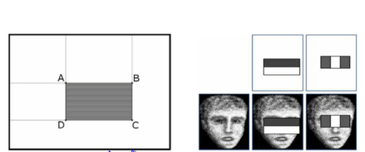

# Week 4 Physiological Biometrics: Facial Recognition Systems

## Directory
- [Home](/README.md#table-of-contents)
- [Week 1 Introduction to Biometrics](/week1/README.md#week-1-introduction-to-biometrics)
- [Week 2 Workings of a Biometrics System](/week2/README.md#week-2-workings-of-a-biometrics-system)
- [Week 3 Physiological Biometrics: Fingerprint Biometrics](/week3/README.md#week-3-physiological-biometrics-fingerprint-biometrics)
- **&rarr;[Week 4 Physiological Biometrics: Facial Recognition Systems](/week4/README.md#week-4-physiological-biometrics-facial-recognition-systems)**
- [Week 5 Other Biometrics: Iris, Hand Geometry, Palm Print, DNA](/week5/README.md#week-5-other-biometrics-iris-hand-geometry-palm-print-dna)
- [Week 6 Heart Beat and Some Machine Learning Algorithms](/week6/README.md#week-6-heart-beat-and-some-machine-learning-algorithms)
- [Week 7 Performance Evaluation](/week7/README.md#week-7-performance-evaluation)
- [Week 8 Behavioral Biometrics: Keystrokes, Gait, Handwriting, Voice](/week8/README,md#week-8-behavioral-biometrics-keystrokes-gait-handwriting-voice)
- [Week 9 Continuous Authentication](/week9/README.md#week-9-continuous-authentication)
- [Week 10 Biometric Systems Security](/week10/README.md#week-10-biometric-systems-security)

## Physiological Biometrics: Facial Recognition Systems

### Face Recognition: Advantages and Disadvantages

- Given still or video images of a sight, recognize one or more faces in the scene using a stored database of faces
  - face detection: finding a face in a scene
  - assigning a name or ID to a detected face

- Advantages
  - no physical contact; noninvasive
  - easy storage of templates
- Disadvantages
  - face changes over time
  - different expressions such as light smile or anger, side poses, lighting conditions, can affect results

- large application domain - security - authentication; commercial etc
- research interest by not only computer science researchers, but also neuroscientists and psychologists

### History
- mid 1960s: first successful face recognition developed by Woodrow Wilson Bledsoe
  - manual operation - worker would record the coordinates of facial features such as the center of each eye, tip of the nose
  - average time: about 90 seconds per face
  - computer was used to match the face with a database of faces
- 1970s: Goldstein Harmon and Lesk. A similar system based on features such as hair color and lip thickness
- A truly autonomous system
  - 1988 eigenface method by Sirovich and Kirby - uses principal component analysis
  - recognizing faces in real time is difficult because of complexity of categorizing the features of a human face
  - 2001 - first face detection algorithm capable of operating real-time, by Viola and Jones

**Face Recognition and Face Detection are two separate problems**

### Face Recognition

> Given still or video images of a sight, recognize one or more faces in the scene using a stored database of faces
- two separate but related parts:
  - face detection
    - finding any and all faces in an image (does not matter whose face)
  - face recognition
    - connecting specific name to a specific face

### Face Recognition Methods

Object Recognition
- Photometric Methods (appearance-based)
  - skin color and a person's contrast with the image background to aid in face recognition
- Geometric (feature-based)
  - features - edge detection, finding discontinuities in image brightness or color and comparing them to a database
  - blob detection - blob is a region of a picture with consistent property (color, intensity, etc) that differs from the surrounding regions

- Viola and Jones detection method
  - locates the generate features in an image - eyes and nose; does not match these features to a specific person
- conversely, the eigenface recognition method compares and contrasts individual features
  - requires faces in a consistent format
  - does not work with a face before it has been cropped from a complex scene

- Initial face detection - viola-jones object detection framework
  - crop the detected faces
- apply eigenface framework
  - project detected face into an eigenvector
  - compare eigenvector with the precompiled database or eigenfaces and find the closest match
- Face Detection (FD), Projection (PJ), and Search (S)

### Face Recognition System

Face Detection - Object Detection Method by Paul Viola and Michael Jones
 
Viola-Jones Object Detection Framework (real time)
- essentially a type of blob detection algorithm
- uses haar-like features, which are pixel intensity sums and differences between rectangular sections of an image (named for similarity to Haar wavelets)
- features are combinations of multiple rectangular sections
- known patterns can be identified as known pieces (from a database such as eyes, cheeks, etc)
- Framework is Haar-like features and use the classifiers (adaboost)
- key feature of the viola-jones framework is the classifier cascade
- windows from the image that are determined not to contain face are discarded; that contain face are passed on to the next stage
  - allows operation in real time because of early detection

The sum pixel intensity of the shaded rectangle can be computed with only **4** stored values
 
- 3 key features that allow viola-jones algorithm to operate with high success in real time are:
  - integral image
    - method for representing the sum intensities of subsets and features of an image in an efficient format
  - face feature classifiers
    - strong classifier is constructed from multiple weak classifiers that recognition Harr like features
  - cascade classifiers
    - negative areas in an image are ruled out quickly while possible faces are more rigorously tests

- AdaBoost (adaptive boosting)
  - combines multiple weak classifiers and iterates through them and forms a strong classifier by taking a weighted average
    - eyes are darker than the cheeks below bridge of nose (100% recognition)
    - images without faces will also be detected (40%)
  - windows from pictures determined not to contain faces are discarded early
    - more complex classifiers on only relevant data (very fast)
  - number of stages required in the pipeline is determined by the false positives and false negatives ratings
    - ~30 stages are sufficient to reduce false positives to less than 1% of images while maintaining a 99% detection rate
    
### Face as a Matrix
- Recognition system based on determining defining characteristics of face, such as shape and size of jaw and chin; and location of nose, lips, cheekbones, eyes
- three major ways of face recognition
  - facial metrics: measures distances between pupils or from nose to lips, or nose to chin etc
  - eigenfaces: analysis of face image as a weighted combination of a number of faces
  - skin texture analysisL skin-based analysis, such as lines, patterns, and spots on the face
- face can be represented as a matrix
- Binary valued; gray level 0-255; or RGB

### Edge Detectors

Histogram
- Radiometric **resolution** determines how finely a system can represent or distinguish differences of **intensity**
  - expressed as a number of levels or a number of bits - example: eight bits or 256 levels, typical of computer image files
  - the resolution of the human eye considerably exceeds 256 shades and can probably do ~4,000
  - zero to 255 - typically, zero is taken to be black, and 255 is taken to be white; values in between make up the different shades of gray

#### Sobel Operator
- performs a 2-D spatial gradient measurement on an image
- emphasizes regions of high spatial frequency that correspond to edges
- typically, it is used to find the approximate absolute gradient magnitude at each point in an input grayscale image

The operator consists of a pair of 3x3 convolution kernels
$$
\left[\begin{array}{ccc}
-1 & 0 & 1 \\
-2 & 0 & 2 \\
-1 & 0 & 1 \\
\end{array}\right]
\left[\begin{array}{ccc}
-1 & -2 & -1 \\
0 & 0 & 0 \\
1 & 2 & 1 \\
\end{array}\right]
$$
- one kernel is simply the other rotated by 90 degrees

$|G|=\sqrt{G_x^2+G_y^2}$
$|G|=|G_x|+|G_y|$
$\Phi=\arctan{\frac{G_x}{G_y}}$

#### Edge Detector Example

$$
\left[\begin{array}{ccc}
P_1 & P_2 & P_3 \\
P_4 & P_5 & P_6 \\
P_7 & P_8 & P_9 \\
\end{array}\right]
$$

$|G| = |(P_1 + 2 \times P_2 + P_3) - (P_7 + 2 \times P_8 + P_9)| + |(P_3 + 2 \times P_6 + P_9) - (P_1 + 2 \times P_4 + P_7)|$

### Eigenvalues and Eigenvectors
$$
|\mathbf{A} - \lambda \mathbf{I}| = 0
$$
$$
\mathbf{A} = \begin{pmatrix}
2 & \frac{3}{2} \\
2 & 0
\end{pmatrix}
$$
$$
\lambda \mathbf{I} = \lambda \begin{pmatrix}
1 & 0 \\
0 & 1
\end{pmatrix}
$$
$$
\begin{pmatrix}
2 & \frac{3}{2} \\
2 & 0
\end{pmatrix} - \lambda \begin{pmatrix}
1 & 0 \\
0 & 1
\end{pmatrix} = 0
$$
$$
\left| \begin{pmatrix}
2 - \lambda & \frac{3}{2} \\
2 & -\lambda
\end{pmatrix} \right| = 0
$$
$$
\lambda^2 - 2\lambda - 3 = 0 \\
\lambda = 3 \text{ or } \lambda = 1
$$

For $\lambda=3$, we look for solutions 
$$
\left| \begin{pmatrix}
-1 & \frac{3}{2} \\
2 & -3
\end{pmatrix} \right| \mathbf{v} = 0
$$

- Since the second equation is a constant multiple of the first, this system of equations reduces to the single equation -x+(3/2)y=0 or equivalently x=1.5y. This system has an infinite number of solutions
- choosing y=2 yields the vector \<3,2> which is thus an eigenvector that has eigenvalue 3. In general for, all eigenvectors with eigenvalue 3 have the form <2t,3t> where t is any real number . It can also be shown (by solving the system (A+I)v=0) that vectors of the form <t-2t> are eigenvectors with eigenvalue k=-1
- find the eigenvalues and eigenvectors of 

$$
A=\begin{pmatrix}
-1 & -1 \\
5 & -3
\end{pmatrix}
$$

#### Autoencoder

input $x_1...x_n$, output $x_1...x_n$
- Perceptron
- given an input, there is a linearly independent set of eigenvalues
- for eigenface
  - there is an independent set of faces and theoretically any face in the world is a combination of any set of eigenfaces.

### Principal Component Analysis
- Principle component analysis
  - used to create a low dimensional representation of faces
  - a statistical operation that converts a conventional dataset into a dataset of variables that are linearly uncorrelated
  - the basis vectors formed are called eigenfaces
  - the PCA on training images results in eigenfaces that can be linearly combined to recreate any of the original image
  - theoretically, any other human face
  - the face is represented an array of eigenvalues that represent the weight each eigenface holds when combining them into a face

- Face1: 0.35 \* eigenface1+0.23 \* eigenface2 - 0.17 eigenface3

### Eigenfaces Illustration
- find a set of images called eigenfaces, which are eigenvectors of the training data
- give weights to the eigenfaces and add them; should give back the desired image

The image on the right was constructed by taking a weighted summation of all the basis faces and then adding them to the mean face

#### Example
(see video)
- Assumptions
  - M training images
  - k significant eigenfaces
    - k\<M
  - $N\times{}N$ and $N^2\times{}1$

### Additional Methods

#### EBGM (Elastic Bunch Graph Matching)
- all human faces share a similar topological structure. Faces are represented as graphs, with nodes positioned at fiducial points (eyes, nose) and edges labeled with 2-D distance vectors. Each node contains a set of 40 complex Gabor wavelet coefficients at different scales and orientations (phase, amplitude).

#### EP (eigenspace-based adaptive approach)
- searches for the best set of projection axes in order to maximize a fitness function, measuring at the same time the classification accuracy and generalization ability of the system
- the dimension of the solution space is big; solved by a specific kind of genetic algorithm called Evolutionary Pursuit (EP)

#### Kernel Methods
- the face manifold in subspace need not be linear. Kernel methods are a generalization of linear methods; direct nonlinear manifold schemes are explored to learn this nonlinear manifold.

### Advanced Methods of Face Detection

#### Trace Transform
- a generalization of the Radon transform
- can be used for recognizing objects under transformations, eg, rotation, translation, and scaling
- one computes a functional along tracing lines of an image; different trace transforms can be produced from an image using different trace functionals

#### AAM (Active Appearance Model)
- is an integrated statistical model which combines a model of shape variation with a model of the appearance variations in a shape-normalized frame
- contains a statistical model of the shape and gray-level appearance of the object of interest which can generalize to almost any valid example
  - matching to an image involves finding model parameters which minimize the difference between the image and synthesized model example projected into the image

#### 3D Face Recognition
- the ability to compare surfaces independent of natural deformations resulting from facial expressions
  - the range image and texture of the face are acquired
  - the range image is preprocessed by removing certain parts such as hair, which can complicate the recognition process. Finally a canonical form of the facial surface is computed; such a representation is insensitive to head orientations and facial expressions, thus significantly simplifying the recognition procedure
  - The recognition itself is performed on the canonical surfaces

#### 3D Morphable Model
- the 3D model is better for representing faces especially o handle facial variations, such as pose, illumination etc
- Blantz et al proposed a method based on a 3D morphable face model that encodes shape and texture in terms of model parameters, an algorithm that recovers these parameters from a single image of a face

#### Areas of Further Interest

- Face emotion detection
- 3d faces - reconstruction recognition
- fast face recognition methods among millions of faces
- face aging
- sibling identification from faces
- recognition from outdoor facial images
- recognition from non-frontal facial images
- recognition at low false accept/alarm rates
- greater understanding of the effects of demographic factors on performance
- development of better statistical methods for understanding performance
- develop improved models for predicting identification performance on very large galleries
- effect of algorithm and system training on covariant performance
- integration of morphable models into face recognition performance

### Security Issues: Face Recognition

- Methods of spoofing face recognition systems
  - face mask
  - surgery
  - makeup
  - presentation
- Detection of spoofing
  - testing for liveness
    - blood flow
    - depth

### Special Topics
- face detection under makeup
  - look at features invariant to makeup
  - malicious or not
- detecting altered faces
  - malicious or not

## Live Session

### Feature Extraction

- original image
  - local orientation
    - segmentation
    - singularity detection
  - local frequency 
    - enhancement (improved image)
    - minutiae extraction
      - binarization or grayscale

### Fingerprint Images
- **Ridges**: raised curves of skin on the finger
- **Valleys**: areas between the ridges
- these features allow humans to better feel textures

- **Singularity**: a region where ridge lines assume distinctive shapes (characterized by high curvature, frequent termination, etc)
- three types
  - loop
  - delta (arch)
  - whorl
- **core**: a landmark or center point
  - orientation finding

### Minutiae
- minutiae: local level features, these refer to the ways that ridges can be discontinuous
  - there are many different discontinuous patterns. The FBI focuses only on:
    - terminations: a ridge that ends abruptly
    - bifurcations: a ridge that splits into two distinct ridges
- minutiae are a tuple: {class, x, y, &theta;}

### Local Ridge Orientation
- what is it? An angle &theta; that the fingerprint ridges, crossing theough an arbitrary small neighborhood centered at [i,j] from the horizontal axis
- how do we measure it?
  - gradient phase angle
  - local averaging
  - gradient estimates
- why do we need it?
  - enhancement
  - singularity detection

#### Least mean square orientation

### local Ridge Frequency
- what is it? Inverse of the number of ridges per unit length along a hypothetical segment centered at [i,j] and orthogonal to the ridge orientation
- how much white space between the ridges on a fingerprint

### Enhancements

- simple image enhancements can be done by applying a filter (function) to an entire image
  - **histogram equalization** spread out gradient on 
  - **gabor filters** have both frequency-selective and orientation-selective properties and have optimal join resolution in both spatial and frequency domains

### Singularity Detection: Poincare index
$$
\Delta(k) = 
\begin{cases} 
\delta(k) & \text{if } |\delta(k)| < \frac{\pi}{2} \\
\delta(k) + \pi & \text{if } \delta(k) \leq -\frac{\pi}{2} \\
\delta(k) - \pi & \text{if } \delta(k) \geq \frac{\pi}{2}
\end{cases}
$$
$$
\delta(k) = \theta((k + 1)\%N) - \theta(k)
$$
$$
\text{if } \sum_{k \in \{0, \ldots, 7\}} \Delta k 
\begin{cases} 
360, & \text{then whorl} \\
180, & \text{then loop} \\
-180, & \text{then delta} \\
0, & \text{then no singularity}
\end{cases}
$$

### Minutiae extraction

- grayscale
- binarization
- thinning
- image scan

detect pixels that corresponds to minutiae through the pixel-wise computation of crossing numbers
$\text{crossing number} = \frac{1}{2} \sum_{i \in \{1,\ldots,8\}} |b[i] - b[(i + 1) \mod 8]|$

- crossing number of 3 is a bifurcation
- crossing number of 1 is a termination
- crossing number of 2 is nothing/ridge

### Correlation Matching
- 