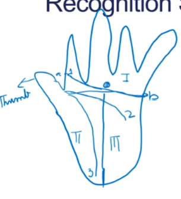

# Week 5 Other Biometrics: Iris, Hand Geometry, Palm Print, DNA

## Directory
- [Home](/README.md#table-of-contents)
- [Week 1 Introduction to Biometrics](/week1/README.md#week-1-introduction-to-biometrics)
- [Week 2 Workings of a Biometrics System](/week2/README.md#week-2-workings-of-a-biometrics-system)
- [Week 3 Physiological Biometrics: Fingerprint Biometrics](/week3/README.md#week-3-physiological-biometrics-fingerprint-biometrics)
- [Week 4 Physiological Biometrics: Facial Recognition Systems](/week4/README.md#week-4-physiological-biometrics-facial-recognition-systems)
- **&rarr;[Week 5 Other Biometrics: Iris, Hand Geometry, Palm Print, DNA](/week5/README.md#week-5-other-biometrics-iris-hand-geometry-palm-print-dna)**
- [Week 6 Heart Beat and Some Machine Learning Algorithms](/week6/README.md#week-6-heart-beat-and-some-machine-learning-algorithms)
- [Week 7 Performance Evaluation](/week7/README.md#week-7-performance-evaluation)
- [Week 8 Behavioral Biometrics: Keystrokes, Gait, Handwriting, Voice](/week8/README,md#week-8-behavioral-biometrics-keystrokes-gait-handwriting-voice)
- [Week 9 Continuous Authentication](/week9/README.md#week-9-continuous-authentication)
- [Week 10 Biometric Systems Security](/week10/README.md#week-10-biometric-systems-security)

## Other Biometrics: Iris, Hand Geometry, Palm Print, DNA

### Iris

#### Iris Recognition System
- Based on the iris pattern in human eye
  - iris is a pigmented elastic tissue with adjustable circular opening in the center; it controls the diameter of the pupil
  - in adult humans, texture of the iris is stable throughout life
  - color and patterns of iris are unique for each person
  - left and right eyes have different iris patterns
- process of recognition
  - take a picture of iris with a capable camera
  - compare the image of the iris with the template using pattern-matching algorithms

#### Merits and Demerits
- Merits
  - highly accurate (chance of matching two iris patterns from different people is one in 10 billion)
  - highly stable because iris patterns don't change over a person's lifetime
  - images can be taken with glasses or contact lenses
  - no physical contact
  - because of small size of template, verification is fast, typically around three seconds
- Demerits
  - iris scanners are expensive

### Hand Geometry

#### Hand Recognition System
- width
- length
- bone structure
- All extraction reduces to feature extraction from an image
- based on the characteristics of palm, such as the length and width of palm, fingers, bone structure, and the surface area of palm
- different people have different palm structures
- can be contact-based, such as placing the hand on a scanner
  - placement may be guided by positioning pins, which align the hand correctly for the camera
  - or it can be contactless, such as through a camera

#### Merits
- sturdy and user-friendly - ease of use is high
- changes in skin moisture or do not affect the results

#### Demerits
- lot of overlap in the structure of hands of different people

### Palm Print

#### Palm Print Recognition System

- palm prints are correlated with medical disorders
  - genetic disorders
  - downs syndrome

- Fortune Telling...
- Palm print is unique and stable over a period of time

1) heart line
2) head line
3) life line

- I) Finger root region
- II) inside region
- III) outside region

- Principal lines: 1, 2, 3
- Regions: I, II, III
- data points: end points across the palm and their midpoints

- geometric features: width, length, area
- wrinkle features: lines other than the principal lines
- delta point features: center of delta like regions
- minutiae features
  - bifurcate
  - terminate

#### Feature Points

- advantages
  - low resolution images okay
  - cheap (inexpensive)
- disadvantages
  - lot of time

#### Palm Print Matching Schemes
- Euclidean distance
- Hamming distance
- Hausdoff Distance
- Feature matching using skeleton lines

### DNA

#### DNA Biometrics
- human body is composed of approximately 60 trillion cells
- DNA (deoxyribonucleic acid) blueprint for the design of human body, folded inside the nucleus of each cell
- DNA is a polymer - has three parts: a base, a sugar, and a phosphate

- Bases are
  - Adenine
  - Thymine
  - Guanine
  - Cytosine
  
- Four letters are present informational content in each nucleotide unit
- variations in nucleotide sequence bring about biological diversity
- DNA exists to double stranded form - to antiparallel strands spiral around each other in a double helix
- A pairs strictly with T
- G pairs strictly with C

#### DNA
- DNA Identification
- Measures short tandem repeat sequences (STRs) in the nuclear or mitochondrial DNA
- STR sequences (typically 23 or more) not linked to any known genetic characteristic
- Vary from person to person - measuring the lengths of the STRs provides highly accurate attributes
- can be stored easily and compared with others
- recent advances have resulted in fast processing - 90 minutes, 30 minutes

- involves generate of DNA profiles, usually with the same core STR (Short Term Repeat) markers, and then matching to a known sample
  - double stranded helical molecule resembling a twisted ladder
  - sugar and phosphate backbone and nucleic acid interior
  - found in the nucleus of all cells (there is also DNA in the mitochondria of cells)
  - bundled into chromosomes
  - chromosomes replicate each time a cell divides

  

- only four nucleic acids
  - A T G C
  - 90 billion pairings

#### Advantages and Disadvantages
- Only biometric that provides possibility of linking relatives to unknown person
- DNA can be left behind (same as fingerprint)
- Rapid DNA identification possible (~30 minutes)
- DNA is unique to every individual on the planet
- it can be easility obtained form a variety of of sources
- it is readiliy used in forensics to match crime scene evidence to individuals
- it does not change during life!

- DNA differs from standard biometrics in several ways
  - DNA requires a tangible physical sample as opposed to an impression, image or recording
  - DNA Matching is not done in real-time, and currently not all stages of comparison are automated
  - DNA matching does not employ templates of feature extraction, but rather represents the comparison of actual samples

During replication, the two DNA strands separate or denature, and a new complementary strand is constructed using the exposed bases as a template

### DNA Typical Process
- DNA Sequencing generates a DNA profile
- Amplified DNA is loaded into the genetic analyzer (Sequencer) with fluorescent labeled A,T,C, and G's attached to the DNA
- An electric current is applied to the system and th DNA migrates past a laser
  - the bases that pass by the laser are recorded one at atime, until the entire squence is recorded
- once the data are analyzed, a unique DNA profile can be visualized

### Other Biometrics
- DNA Collection
  - anything a person touches etc
  - biological specimens

## Live Session

### Fingerprints (cont)
#### Types of Matching
- correlation matching
- minutiae matching
- ridge feature-based matching

#### Correlation Matching

#### Minutiae Matching

### Face Recognition

1. Ridged-transforms or pose
   - 3D models on the face and project the model onto the face
2. Difference in illumination
   - flash
3. Non-ridged transforms
   - hats, scarfs, face blocking
   - hard problem to solve

#### Algorithmic Bias
- face recognition has an issue with algorithmic bias
  - face detection (identifying faces in pictures)
  - face recognition (matching a face to a person)

- facial recognition doesn't do a good job detecting or recognizing non-white people.

#### why is there a bias?

- what is the training set?
- how are the algorithms made?
- what are possible fixes?

#### Face Recognition Steps
1. Face Detection: detects all faces in an image
    - we'll look at the viola-jones algorithm
2. Projection: projecting the detected faces int an eigenvector
    - we'll look at PCA and eigenvectors
3. Database search: the final step is to compare the eigenvector with the precompiled database of eigenfaces

3 for bifurcation
2 for non minutiae

