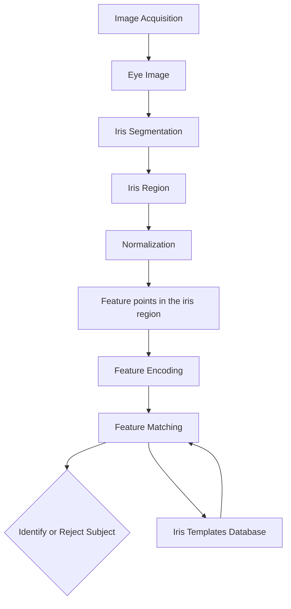

# Week 6 Heart Beat and Some Machine Learning Algorithms

## Directory
- [Home](/README.md#table-of-contents)
- [Week 1 Introduction to Biometrics](/week1/README.md#week-1-introduction-to-biometrics)
- [Week 2 Workings of a Biometrics System](/week2/README.md#week-2-workings-of-a-biometrics-system)
- [Week 3 Physiological Biometrics: Fingerprint Biometrics](/week3/README.md#week-3-physiological-biometrics-fingerprint-biometrics)
- [Week 4 Physiological Biometrics: Facial Recognition Systems](/week4/README.md#week-4-physiological-biometrics-facial-recognition-systems)
- [Week 5 Other Biometrics: Iris, Hand Geometry, Palm Print, DNA](/week5/README.md#week-5-other-biometrics-iris-hand-geometry-palm-print-dna)
- **&rarr;[Week 6 Heart Beat and Some Machine Learning Algorithms](/week6/README.md#week-6-heart-beat-and-some-machine-learning-algorithms)**
- [Week 7 Performance Evaluation](/week7/README.md#week-7-performance-evaluation)
- [Week 8 Behavioral Biometrics: Keystrokes, Gait, Handwriting, Voice](/week8/README,md#week-8-behavioral-biometrics-keystrokes-gait-handwriting-voice)
- [Week 9 Continuous Authentication](/week9/README.md#week-9-continuous-authentication)
- [Week 10 Biometric Systems Security](/week10/README.md#week-10-biometric-systems-security)

## Heart Beat and Some Machine Learning Algorithms

### Structure of the Heart and Source of Features
- structure of heart and feature set
  - source of biometric features:
    - the geometry and physiology of the heart differ from one individual to another as well as through variations in conductivity within the body.

- structure
  - periocardinal cavity
  - four chambers
    - right atrium
    - left atrium
    - right ventricle 
    - left ventricle
- state
  - systole
    - muscle relaxes to allow chambers to fill with blood
  - diastole
    - muscle tissue is contracted
  - systolic pressure/diastolic pressure
- cardiac cycle (one heartbeat)
  - atrial systole
  - ventricle systole
  - relaxation of the ventricles
- ECG/EKG
  - p increase voltage
  - qrs complex
    - q small drop voltage
    - r large peak voltage
    - s drop voltage
  - t wave, ventricle repolarization during relaxation phase

  - distances between waveforms can be used more medical diagnosis
    - can be used for identification of an individual

### ECG and PPG Signals
- ECG (electrocardiogram) refers to recorded electrical signals the originate in different regions of heart. Most ECGs are performed using electrodes placed at different parts of the body. ECG signals result from summing potential differences between electrode pairs
- PPG (photoplethysmography) relates the use of illumination-based sensors that are sensitive to volume changes in the blood as it travels through body
- CO (Cardiac output) blood pumped in one minute
- 5 to 5.5 liters per minute

#### Noninvasive heartbeat measurements
- radar
- thermal imaging
- laser doppler vibrometry

### Features from the Cardiac Cycle
- ballistocardiography
  - a noninvasive method of characterizing an individual's cardiac cycle based on the measurement of their body's motion.
  - A measure of the extent to which body moves as the blood accelerates though the body in response to the beating of the heart
- so, if we can measure movement of a person's body part, we can use ballistocardiography to obtain signals that are measures of their cardiac cycle

- These measurements can be converted into several physiological signals: blood volume pulse (BVP), respiration (RESP), and ballistocardiogram (BCG) where
  - BVP: a measure of distention of the arteries as the blood gushes though with the beating of the heard
  - BCG: a measure of the acceleration of the limbs of body resulting from cardiac ejection of blood

- Both BCG and BVP have been shown to be an alternative representation of the cardiac process, much like electrocardiogram or continuous blood pressure signals.

### ECG Features of Authentication

| Features                | Features               |
|-------------------------|------------------------|
| Average QRS interval    | Average Difference QRS |
| Average RR interval     | Average Difference RR  |
| Average QQ interval     | Average Difference QQ  |
| Average SS interval     | Average Difference SS  |
| Average QR interval     | Average Difference QR  |
| Average RS interval     | Average Difference RS  |
| Average Beats           | Average Difference Beats |

### Contact and Noncontact Heart-Based Authentication

ECG
- right arm
- left arm
- left leg
- right leg

Non contact PPG from video data is possible.
- point light that interacts with the hemoglobin (blood)
- Intensify
  - blood volume
  - wavelength of the lighting source

#### Some resources
- fitbit can estimate rate
- aive core = ECG like signal
- Nymi band = ECG signal
- PPG sensors hae proposed in the form of a ring

### Transition to ML Concepts
Sources of biometrics
- Face
- Fingerprint
- Heart
- Keystrokes

Algorithms
- Distance functions
- classifiers
  - k-means
  - naive bayes

### Fourier

#### Fourier Transform
- A time-domain graph shows how a signal changes over time
  - time is x-axis
  - y-axis is the amplitude of the signal

- A frequency-domain graph shows how much of the signal lies within each given frequency band over a range of frequencies
  - frequency = 1/time
  - x-axis is frequency
  - y-axis is fractoin of signal at that frequency
- fourier transform converts from time-domain to frequency domain

#### Band Pass Filters

## Live Session

### Face recognition steps
- face detection
- projection
- database search

[Principal Component Analysis](https://en.wikipedia.org/wiki/Principal_component_analysis)

### Viola-jones: face detection
- haar features
- integral image
  - speeds up processing by reducing the image into summed values
- adaboost
  - create multiple classifiers progressively weighting points as more or less well classified
  - combine the classifiers at the end
- cascading

!!Understand principal component analysis

### Iris Detection

#### Iris Layers
 
- epithelium layer
- stromal layer

